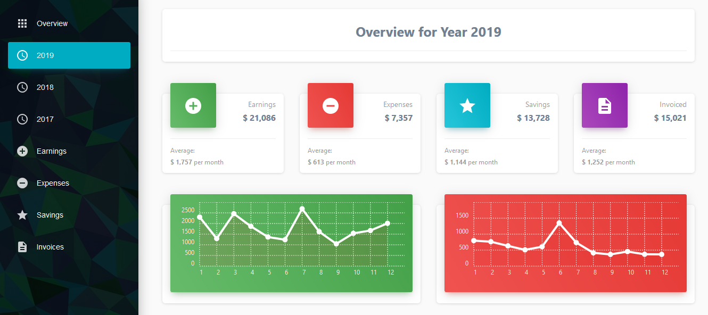
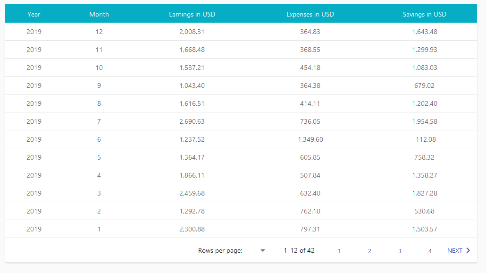
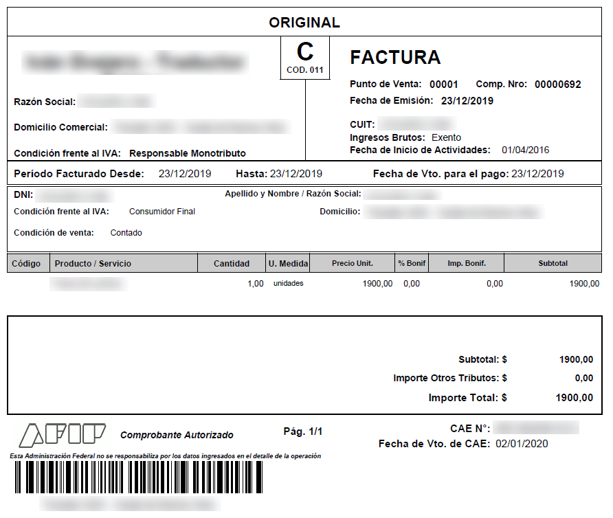
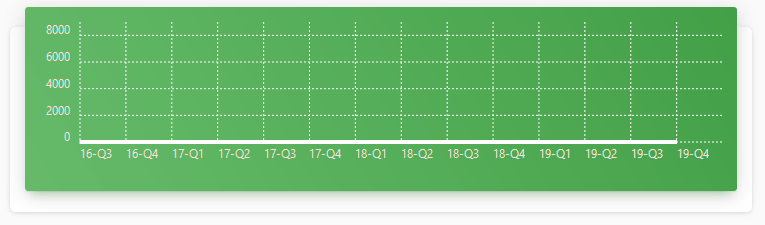
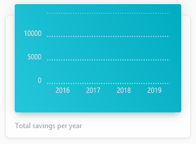
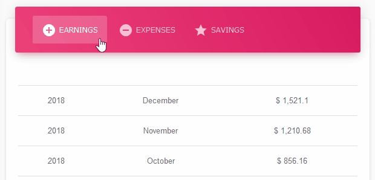

# monotax

[](https://opensource.org/licenses/MIT)

Colorful dashboard to display financial stats for a side business.

Built with TypeScript/React, TypeScript/Node and SQLite.

<br>

<p align="center">
    
    &nbsp;&nbsp;&nbsp;&nbsp;
    
    &nbsp;&nbsp;&nbsp;&nbsp;
    
    &nbsp;&nbsp;&nbsp;&nbsp;
    
</p>

<br>

## Overview

Quick app to display a client's earnings, expenses, savings and invoices in material design, including a CLI utility for PDF invoice parsing.

<p align="center">
    
</p>

Features:

- Views for all-time, quarterly, yearly and monthly stats
- Views for earnings, expenses, savings and invoices
- CLI utility for quick PDF-to-SQLite conversion
- Colorful animated charts and tabbed tables
- Expanding panels, pagination and sorting

## Screenshots

<p align="center">
    
</p>

<p align="center">
    
</p>

## Installation

1. Install [Node](https://nodejs.org/en/download/) and clone repo
2. Install dependencies: `npm i && cd client npm i`
3. Run server and client: `npm run both`

## Operation

PDF invoices are placed at `data/pdf` and parsed with `npm run parse`. The invoices must be formatted as those issued under the monotax scheme of Argentina's Federal Administration of Public Revenue.

Every PDF is converted to a JSON object and is persisted in the database at `data/sql/monotax.db`. The db is pre-populated with earnings, expenses and ARS-USD exchange rate data, queriable through 35+ SQL views, many of which are used by the backend. A demo db and its full schema are included.

PDF invoice sample:

<p align="center">
    
</p>

JSON object sample:

```json
{
	date: "Mon Dec 23 2019 12:41:30 GMT-0300 (Argentina Standard Time)",
	id: "692",
	name: "Lorem Ipsum",
	address: {
		street: "Dolor Sit",
		province: "Amet",
	}
	client_id: {
		type: "DNI",
		number: "12934612",
	}
	vatStatus: "Consumidor Final",
	amount: 1900.00
}
```

The frontend relies on [React Admin](https://github.com/marmelab/react-admin) to auto-fetch data for views corresponding to earnings, expenses, savings and invoices. The client also makes requests custom endpoints to fetch data for the global overview and the yearly stats views.

```ts
// setAutomaticRoutes.ts → four React Admin endpoints
const setAutomaticRoutes = (app: express.Application) => {
	const autoRoutes = ["invoices", "earnings", "expenses", "savings"];
	autoRoutes.forEach(route =>
		app.get(
			"/api/" + route,
			(request: express.Request, response: express.Response) =>
				createAutomaticRoute(request, response, route)
		)
	);
};

const createAutomaticRoute = (
	request: express.Request,
	response: express.Response,
	route: string
) => {
	const { offset, limit } = request.query;
	const [field, order] = JSON.parse(request.query.sort);
	const results = DatabaseService.getAllRecords(
		VIEWS[route],
		offset,
		limit,
		field,
		order
	);
	const total = DatabaseService.getCount(VIEWS[route]);
	return response
		.status(200)
		.set("Content-Range", route + "0-15/" + total)
		.set("Access-Control-Expose-Headers", "Content-Range")
		.json(results);
};
```

```ts
// dataProvider.ts → four API calls
getList: (resource: string, params: GetListParams) => {
	const { page, perPage } = params.pagination;
	const { field, order } = params.sort;

	const query = {
		filter: JSON.stringify(params.filter),
		offset: JSON.stringify((page - 1) * perPage),
		limit: JSON.stringify(perPage),
		sort: JSON.stringify([field, order])
	};
	const url = `${apiUrl}/${resource}?${stringify(query)}`;

	return httpClient(url).then(({ json, headers }: any) => {
		return {
			data: json,
			total: parseInt(
				headers
					.get("Content-Range")
					.split("/")
					.pop(),
				10
			)
		};
	});
};
```

```ts
// setCustomRoutes.ts → four custom endpoints
const setCustomRoutes = (app: express.Application) => {
	app.get("/api/overview/", (request, response) => {
		const quarterlyData = DatabaseService.getQuarterlyData();
		const allTimeTotals = DatabaseService.getAllTimeTotals();
		const yearlyTotals = DatabaseService.getYearlyTotals();
		const monthlyAveragesPerYear = DatabaseService.getMonthlyAveragesPerYear();
		const lastSixMonthsValues = DatabaseService.getLastSixMonthsValues();

		response.status(200).json({
			quarterlyData,
			allTimeTotals,
			yearlyTotals,
			monthlyAveragesPerYear,
			lastSixMonthsValues
		});
	});

	const years = ["2017", "2018", "2019"];
	years.forEach(year =>
		app.get("/api/year/" + year, (request, response) => {
			const yearData = DatabaseService.getYearData(year);
			const totalsForYear = calculateTotals(yearData);

			response.status(200).json({
				earningsForYear: yearData["earnings"],
				expensesForYear: yearData["expenses"],
				savingsForYear: yearData["savings"],
				invoicedForYear: yearData["invoiced"],
				totalsForYear
			});
		})
	);
};
```

The dashboard borrows from [Material UI](https://material-ui.com/) icons and components, located at `client/src/mdr`, to display data in colorful boxes, animated charts and tabbed tables.

<p align="center">
    
</p>

<p align="center">
    
    &nbsp;&nbsp;&nbsp;&nbsp;
    
</p>

A dev proxy is set up so that any request from the client at `http://localhost:3000/` made to an `/api/` endpoint is redirected to the server at `http://localhost:5000/`. See the CRA docs on [API request proxying](https://create-react-app.dev/docs/proxying-api-requests-in-development/).

```js
const { createProxyMiddleware } = require("http-proxy-middleware");

module.exports = function(app) {
	app.use(
		"/api",
		createProxyMiddleware({
			target: "http://localhost:5000",
			changeOrigin: true
		})
	);
};
```

## Author

© 2020 Iván Ovejero

## License

Distributed under the MIT License. See [LICENSE.md](LICENSE.md)

<!-- Model: http://webapplayers.com/inspinia_admin-v2.9.3/

Better SQlite documentation: https://github.com/JoshuaWise/better-sqlite3/blob/master/docs/api.md
React Admin documentation: https://marmelab.com/react-admin/Readme.html
Material Design React documentation: https://demos.creative-tim.com/material-dashboard-react/#/documentation/tutorial
Material Design React demo: https://demos.creative-tim.com/material-dashboard-react/#/admin/dashboard

Pending:

- Sixth item -->
